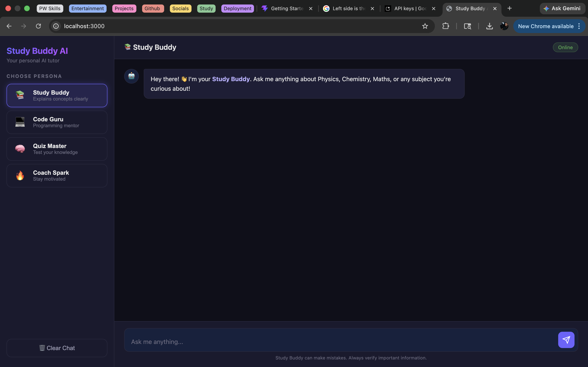

# 📚 Study Buddy AI

Your personal AI-powered study companion that adapts to your learning style.

Study Buddy AI is a multi-persona chatbot built using the Gemini API, designed to help students learn, code, revise, and stay motivated — all in one place.

---

## Live Link 

 - Live link - https://ai-chatbot2026.netlify.app/

---

## 🚀 Features

- 🎓 **Study Buddy** – Explains concepts clearly (Physics, Chemistry, Maths, etc.)
- 💻 **Code Guru** – Helps with programming and debugging
- 🧠 **Quiz Master** – Tests your knowledge with interactive quizzes
- 🔥 **Coach Spark** – Keeps you motivated and productive
- ⚡ Real-time responses using Gemini API
- 🎨 Clean and modern UI
- 🟢 Online status indicator for AI availability

---

## 🛠️ Tech Stack

- **Frontend:** HTML, CSS, JavaScript
- **Backend:** Express.js
- **AI Integration:** Google Gemini API
- **Environment Management:** dotenv

---

## 📸 Preview

- 

---

## 💡 How It Works

1. **Persona Selection**  
   The user selects a specific AI persona (Study Buddy, Code Guru, Quiz Master, or Coach Spark) based on their need.

2. **User Input Processing**  
   The user's query is captured through the chat interface and prepared for the API request.

3. **Prompt Engineering**  
   A persona-specific prompt is dynamically generated to guide the AI’s response style and context.

4. **Gemini API Interaction**  
   The processed input is sent to the Gemini API, which generates a relevant and contextual response.

5. **Real-Time Response Rendering**  
   The AI response is displayed instantly in the chat interface with a smooth UI update.

---

## 🎯 Future Improvements

- 🔐 Implement user authentication and login system  
- 📊 Add a personalized progress tracking dashboard  
- 🗂️ Enable chat history storage and retrieval  
- 🌐 Deploy the application (Vercel / Netlify)  
- 🧠 Improve context retention for smarter conversations  
- 📱 Optimize UI/UX for mobile responsiveness  

---

## 🙌 Acknowledgements

- Google Gemini API for powering the AI responses  
- Open-source community for UI/UX inspiration  
- Modern AI chatbot platforms for design references  

---

## 📬 Contact

**Anurag Arora**  
📍 Lucknow, India  
📧 anurag.arora1727@gmail.com  
🔗 LinkedIn: https://www.linkedin.com/in/anurag-arora-b4a151192  
💻 GitHub: https://github.com/AnuragA1727  

---

## ⭐ Support

If you found this project helpful, consider giving it a star ⭐ on GitHub!

---
